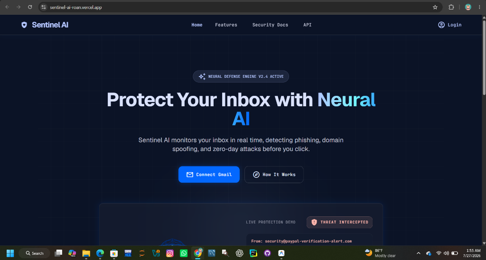
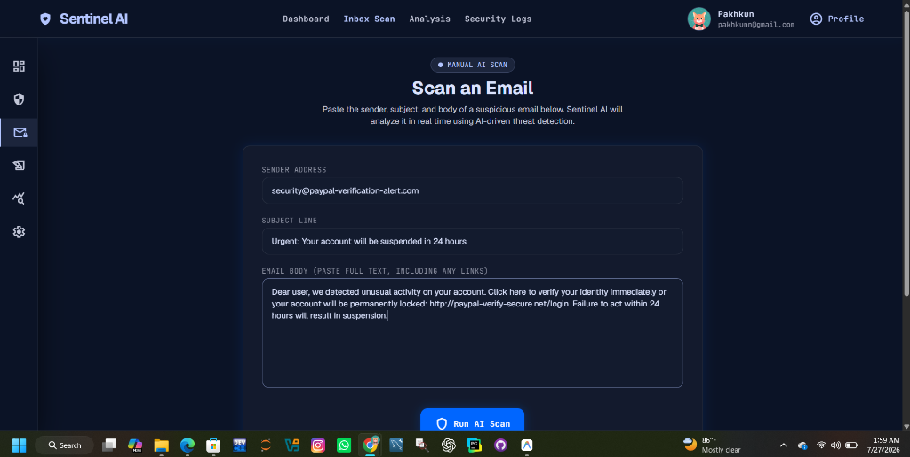
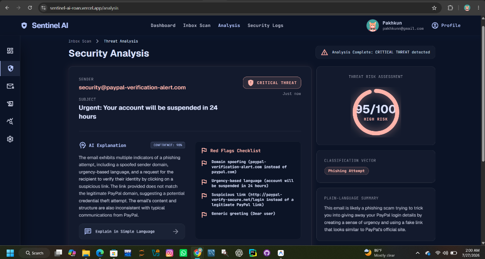
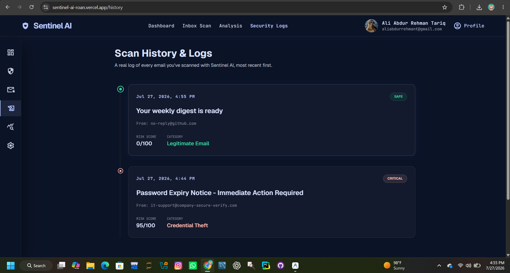

# Sentinel AI 🛡️

**Sentinel AI** is a real-time email threat analysis platform that uses AI to detect phishing, scam, and social-engineering attempts in emails — and explains *why* an email is dangerous in plain language anyone can understand.

## Table of Contents

- [The Problem](#the-problem)
- [Live Demo](#live-demo)
- [Features](#features)
- [The AI Feature](#the-ai-feature)
- [How It Works (Architecture)](#how-it-works-architecture)
- [Tools, Services & Models Used](#tools-services--models-used)
- [Screenshots](#screenshots)
- [How to Run Locally](#how-to-run-locally)
- [Environment Variables](#environment-variables)
- [Project Structure](#project-structure)
- [Known Scope & Limitations](#known-scope--limitations)
- [Future Improvements](#future-improvements)
- [Author](#author)

## The Problem

Phishing emails are one of the most common ways ordinary people get scammed, lose money, or have their accounts compromised — and most people have no easy way to tell a real email from a fake one. Corporate employees have IT teams and enterprise email security tools protecting them. **Everyday people don't.** A retiree checking their bank email, a student replying to a "financial aid" message, a parent forwarding a "package delivery" text — none of them have a security analyst double-checking these messages before they click.

Sentinel AI puts that same kind of threat analysis in the hands of everyday people: paste in a suspicious email, and get an instant, understandable verdict on whether it's safe.

## Live Demo

🔗 **[https://sentinel-ai-roan.vercel.app](https://sentinel-ai-roan.vercel.app)**

## Features

- **Google Sign-In** — secure authentication via Firebase Auth
- **Manual Email Scan** — paste in a sender, subject, and body, and Sentinel AI analyzes it in real time
- **AI Threat Verdict** — classifies each email as Safe, Suspicious, or Critical, with a 0–100 risk score
- **Plain-Language Explanations** — a "translate this for a non-technical person" breakdown of *why* an email is dangerous, not just a score
- **Red Flags Checklist** — specific indicators the AI found (spoofed domains, urgency tactics, suspicious links, credential requests, etc.)
- **Threat Classification** — categorizes attacks (e.g. Credential Theft, Invoice Scam, Legitimate Email)
- **Real Scan History** — every scan is saved to Firestore and shown on the History page, tied to your account
- **Dashboard and Report views** — UI for reviewing overall inbox health

## The AI Feature

The core of Sentinel AI is a real-time call to an LLM (Groq's `llama-3.3-70b-versatile`) via a server-side API route (`/api/analyze`), driven by a system prompt I wrote specifically for phishing/threat detection:

```
You are Sentinel AI, an email security analyst engine. You are given metadata and
content from a single email. Your job is to determine whether it is a phishing
attempt, a scam, or safe/legitimate email, and explain why.

Analyze the sender address, subject line, body content, and any links provided.
Look for common attack indicators: domain spoofing or lookalike domains, mismatched
display name vs actual email address, urgency or fear-based language, requests for
credentials/payment/personal info, suspicious or shortened links, poor grammar
inconsistent with a legitimate organization, and generic greetings from a
supposedly known sender.

Respond ONLY with valid JSON (no markdown fences, no commentary) matching exactly
this shape:
{
  "threatLevel": "safe" | "warning" | "critical",
  "riskScore": number (0-100),
  "confidenceScore": number (0-1),
  "threatCategory": string,
  "explanation": string,
  "simplifiedExplanation": string,
  "redFlags": string[]
}
```

The email the user submits (sender, subject, body, extracted links) is passed to the model alongside this prompt, and the structured JSON response drives the entire Analysis page — the risk meter, the threat badge, the red flags list, and the plain-language summary are all rendered directly from the AI's real-time output.

## How It Works (Architecture)

```
User logs in (Firebase Google OAuth)
        │
        ▼
   /scan page — user pastes sender / subject / body
        │
        ▼
lib/services/gmail.ts → parseManualEmail()
   (extracts links, structures the email into metadata)
        │
        ▼
lib/services/ai.ts → analyzeEmail()
        │  POST request
        ▼
app/api/analyze/route.ts  (server-side, Next.js API route)
        │  calls Groq API with system prompt + email content
        │  API key never exposed to the browser
        ▼
Groq API (llama-3.3-70b-versatile) returns structured JSON verdict
        │
        ▼
Result stored in sessionStorage → redirect to /analysis
        │
        ▼
   /analysis page renders the real AI verdict
   (risk score, threat level, red flags, explanations)
```

The AI API call happens server-side (inside the Next.js API route) rather than directly from the browser, so the Groq API key stays private and is never shipped to the client.

## Tools, Services & Models Used

- **Framework**: Next.js 14 (App Router), React 18, TypeScript
- **Styling**: Tailwind CSS
- **3D/Visuals**: Three.js
- **Authentication**: Firebase Authentication (Google OAuth)
- **Database**: Cloud Firestore — persists every scan result per-user
- **AI Model**: Groq API — `llama-3.3-70b-versatile`
- **Hosting**: Vercel
- **Version Control**: Git + GitHub

## Screenshots

> _Add at least 3 screenshots here: the landing page, the scan form, and the analysis results page._






## How to Run Locally

1. Clone the repository:
   ```bash
   git clone https://github.com/aliabdurrehmant/SENTINEL-AI.git
   cd SENTINEL-AI
   ```

2. Install dependencies:
   ```bash
   npm install
   ```

3. Set up environment variables — copy `.env.local.example` to `.env.local`:
   ```bash
   cp .env.local.example .env.local
   ```

4. Fill in `.env.local` with your own keys:
   ```
   GROQ_API_KEY=your_groq_api_key_here
   ```
   Get a free Groq API key at [console.groq.com](https://console.groq.com) (no credit card required).

5. Run the development server:
   ```bash
   npm run dev
   ```

6. Open [http://localhost:3000](http://localhost:3000) in your browser.

## Environment Variables

| Variable | Description |
|---|---|
| `GROQ_API_KEY` | API key for Groq, used to power the AI threat analysis feature. Kept server-side only — never exposed to the client. |

Firebase configuration is currently included directly in `lib/services/firebase.ts` for this project's client-side Firebase Auth setup (Firebase web config keys are not secret by design — they identify the project, not authenticate access).

## Project Structure

```
├── app/
│   ├── api/analyze/route.ts   # Server route calling the AI model
│   ├── scan/page.tsx          # Email input form → triggers real AI scan
│   ├── analysis/page.tsx      # Renders the real AI verdict
│   ├── dashboard/page.tsx     # Overview UI
│   ├── history/page.tsx       # Past scans UI
│   ├── report/page.tsx        # Inbox health summary UI
│   ├── onboarding/page.tsx    # Onboarding flow
│   ├── settings/page.tsx      # Settings UI
│   └── login/page.tsx         # Google sign-in
├── components/
│   ├── layout/                # Header, Sidebar, Footer, MobileNav
│   ├── ui/                    # GlassCard, CyberButton, ThreatBadge
│   └── three/                 # 3D shield visual (Three.js)
├── lib/services/
│   ├── ai.ts                  # Calls /api/analyze
│   ├── gmail.ts                # Parses manually-submitted emails
│   ├── auth.ts                 # Firebase Google sign-in
│   ├── firebase.ts             # Firebase client config
│   └── firestore.ts            # Firestore helpers (see Known Scope below)
└── firebase.ts                 # Firebase app initialization
```

## Known Scope & Limitations

In the interest of being transparent about exactly what's real in this build:

- **The core AI scanning loop is fully real and functional end-to-end**: the Scan page → AI analysis (Groq) → Analysis results page all use live data and a real model call, no mocked responses.
- **Manual scanning, not live Gmail integration**: users paste in email content rather than Sentinel AI reading their inbox automatically. This was a deliberate choice — full Gmail API (OAuth `gmail.readonly` scope) integration requires Google's app verification process for production use with arbitrary accounts, which takes days to weeks and wasn't feasible within this project's timeline. This is called out explicitly as a next step below.
- **Real scan history**: every scan is saved to Cloud Firestore under the logged-in user's account (`lib/services/firestore.ts`), and the **History / Security Logs page pulls and displays real past scans** — not sample data.
- **Dashboard and Report pages are still illustrative UI** showing example data rather than aggregating the user's real Firestore scan history. Computing real stats (total scans, threat rate, most common category) from the same Firestore data that now powers History is the direct next step.

## Future Improvements

- Live Gmail inbox scanning via Gmail API (currently limited by Google's OAuth verification requirements for restricted scopes, which require a review process for public production use)
- Persisting scan history to Firestore instead of session-only storage
- Batch scanning of multiple emails at once
- Browser extension for one-click scanning directly from Gmail/Outlook
- User-configurable sensitivity/risk thresholds

## Author

Built by Ali Abdur Rehman Tariq as a final project — an AI-powered email security tool aimed at protecting everyday people from phishing and scam emails.
